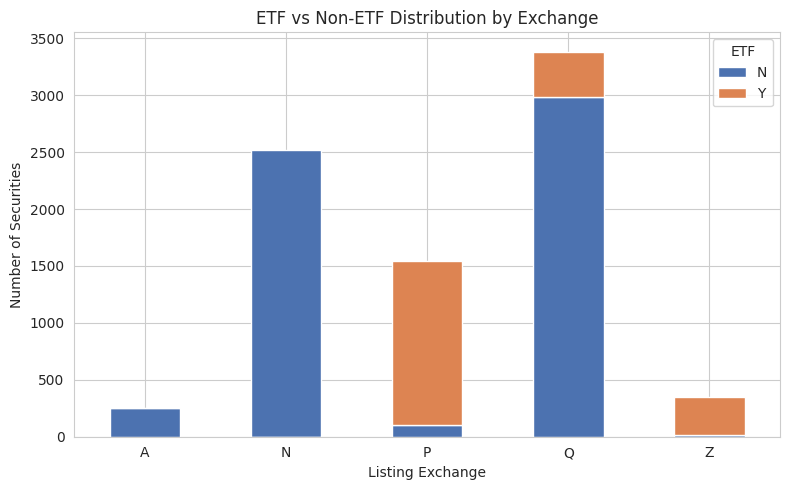

# Stock Market Dataset — Data Cleaning & EDA

Exploratory data analysis and data cleaning on the [`jacksoncrow/stock-market-dataset`](https://www.kaggle.com/datasets/jacksoncrow/stock-market-dataset) Kaggle dataset, focused on the symbol-level metadata file (`symbols_valid_meta.csv`) that describes every stock and ETF listed on NASDAQ.

## Dataset

The dataset is downloaded via [`kagglehub`](https://github.com/Kaggle/kagglehub) and contains:

```
stocks/                     # one CSV per ticker (OHLCV), individual stocks
etfs/                       # one CSV per ticker (OHLCV), individual ETFs
symbols_valid_meta.csv      # metadata for every listed symbol
```

This repo focuses on `symbols_valid_meta.csv` — 8,049 rows describing ticker symbol, security name, listing exchange, market category, ETF flag, and round lot size.

## How to run

```bash
pip install -r requirements.txt
```

```python
import kagglehub

path = kagglehub.dataset_download("jacksoncrow/stock-market-dataset")
```

Then run the notebook (`notebook.ipynb`) cell by cell, or the scripts under `src/`.

## Cleaning steps

1. **Validate before dropping.** Rather than dropping columns on assumption, each candidate column's invariant was checked first (e.g. is `Nasdaq Traded` always `'Y'`? Is `Symbol` always equal to `NASDAQ Symbol`?). Columns were only dropped once the assumption was confirmed to hold for every row.
2. **Dropped:** `Nasdaq Traded`, `Test Issue`, `NASDAQ Symbol` (redundant with `Symbol`).
3. **Kept but inspected:** `Financial Status` — mostly null, but the non-null values flag deficient/bankrupt issuers, so it was preserved rather than dropped.
4. **Duplicate check:** no exact duplicate rows and no duplicate `Symbol` values. 8 rows share a normalized `Security Name` across different symbols (e.g. multiple share classes of the same fund — see below).
5. **Symbol structure:** parsed symbol length and flagged symbols containing non-alphabetic characters (e.g. `AGM$A`, `CARR.V`), which typically indicate special share classes or foreign listings.

## Key EDA findings

| Check | Result |
|---|---|
| Rows | 8,049 |
| Unique symbols | 8,049 |
| ETFs (`ETF == 'Y'`) | 2,165 |
| Listing exchanges | 5 (A, N, P, Q, Z) |
| Standard round lot (100 shares) | 99.94% of rows |
| `ETF` flag vs. fund-like name mismatches | 674 rows |

**Missing data** — only two columns have non-trivial missingness:
- `Financial Status`: 57.97% missing (expected — only populated for flagged issuers)
- `CQS Symbol`: 42.03% missing

**Near-duplicate security names** — 8 rows share a normalized name across two symbols, all legitimate (multiple listed share classes of the same entity, e.g. `ISCF` / `ISZE` both "iShares Edge MSCI Intl Size Factor ETF").

**ETF flag vs. name text** — cross-checking the `ETF` flag against keyword matches (`etf`, `fund`, `trust`, `index`) in `Security Name` surfaced 674 securities flagged `ETF == 'N'` despite a fund/trust-like name (e.g. closed-end funds and REITs such as "Adams Diversified Equity Fund Inc." and "American Assets Trust, Inc."). These are not mislabeled — closed-end funds and trusts are legitimately not ETFs — but the check is a useful guardrail against silent labeling errors in future data refreshes.

**Round lot outliers** — 5 of 8,049 securities don't use the standard 100-share round lot (e.g. `NVR`, `MKL`, `SEB` at 10 or 1 share lots), consistent with their high per-share prices.

**Listing exchange vs. ETF distribution:**



Exchange `Q` (Nasdaq) and `P` (NYSE Arca) carry the largest share of ETFs, while `N` (NYSE) is almost entirely non-ETF listings.

## Project structure

```
.
├── README.md
├── requirements.txt
├── notebook.ipynb
├── assets/
│   └── etf_distribution_by_exchange.png
└── src/
    └── (cleaning + EDA scripts, optional if not using the notebook)
```

## Requirements

See `requirements.txt`. Core libraries: `pandas`, `numpy`, `matplotlib`, `seaborn`, `kagglehub`.

## Next steps

- Cross-check `stocks/` and `etfs/` file counts against the metadata's `ETF` flag counts.
- Join metadata with individual ticker price histories for further analysis.
- Investigate the 674 `ETF`-flag mismatches in more depth (fund type breakdown).
